# CADI-AI Crop Disease Detection — YOLOv8n vs TransFPN-YOLO

Custom object detection project on the **CADI-AI** dataset for identifying **abiotic stress, insect damage, and disease** in crop images. Builds a modified YOLOv8-based detector called **TransFPN-YOLO**, integrating **CBAM attention**, a **Transformer bottleneck**, and **BiFPN** for improved feature fusion.

## Model Deployment
The fine-tuned model is hosted on Hugging Face:
[🤗 iamnotpalak/yolov8-transfpn-crop-disease-detection](https://huggingface.co/iamnotpalak/yolov8-transfpn-crop-disease-detection)

---

## Project Highlights

| | |
|--|--|
| Baseline model | YOLOv8n |
| Custom model | TransFPN-YOLO |
| Dataset | [KaraAgroAI/CADI-AI](https://huggingface.co/datasets/KaraAgroAI/CADI-AI) |
| Classes | `abiotic`, `insect`, `disease` |
| GPU | NVIDIA T4 (16 GB VRAM) |
| Framework | PyTorch + Ultralytics 8.3.0 |

---

## Motivation

The CADI-AI dataset presents three major challenges that drove the custom architecture:

- **Severe class imbalance** — insect dominates (61%), abiotic is underrepresented
- **Small object dominance** — 66.2% of bounding boxes are under 1% image area
- **Dense, cluttered scenes** — overlapping objects and noisy agricultural backgrounds

---

## Repository Structure

```text
.
├── Palak_Bhatt_CADI_AI_Assignment.ipynb   ← full training + evaluation notebook
├── transfpn_yolo.yaml                     ← custom architecture config
├── cadi_ai.yaml                           ← dataset config
├── requirements.txt
├── assets/
│   ├── class_distribution.png
│   ├── bbox_stats.png
│   ├── sample_annotations.png
│   ├── small_object_strategy.png
│   ├── class_imbalance_analysis.png
│   ├── architecture_diagram.png
│   ├── training_curves.png
│   ├── metrics_comparison.png
│   ├── pr_curves.png
│   ├── f1_scores.png
│   ├── confusion_matrices.png
│   ├── per_class_ap.png
│   ├── radar_chart.png
│   ├── iou_distribution.png
│   └── qualitative_results.png
└── README.md
```

---

## Dataset Analysis

### Class Distribution

**Train set:** Abiotic 1,285 · Insect 11,370 · Disease 5,626  
**Val set:** Abiotic 254 · Insect 1,899 · Disease 1,085

The dataset is strongly imbalanced — insect has ~8.8× more annotations than abiotic. Inverse-frequency class weights were applied during training: **Abiotic 2.236 · Insect 0.253 · Disease 0.511**.

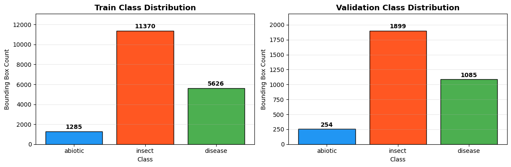

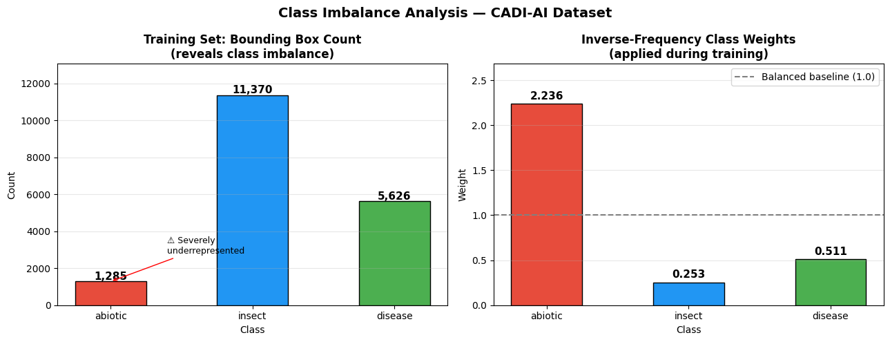

### Bounding Box Statistics

Mean width: **0.088** · Mean height: **0.116** · Mean area: **0.016**

| Object Size | Share |
|-------------|-------|
| Small (<1% area) | **66.2%** |
| Medium (1–10%) | 31.6% |
| Large (>10%) | 2.2% |

The right-skewed area distribution confirms small-object dominance, which directly justifies the 1280px input upgrade — doubling resolution makes small object edges grow from ~64px to ~128px.

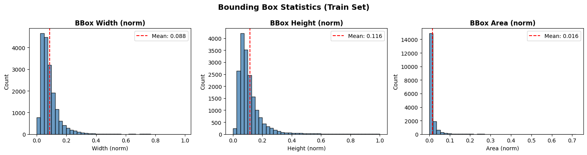

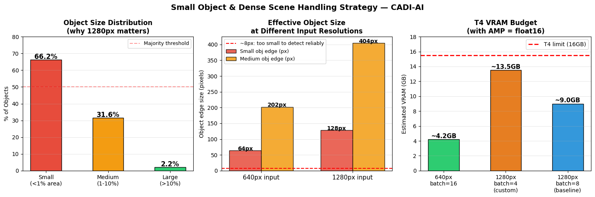

### Sample Annotations

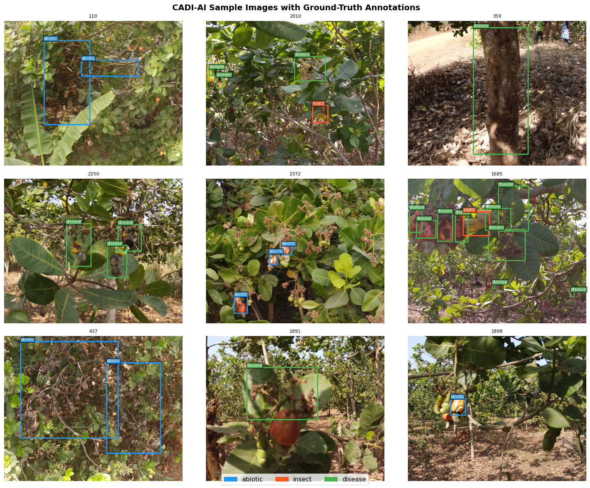

---

## Model Architecture

### Baseline: YOLOv8n

Standard YOLOv8n trained as the reference system at 640px input.

### Custom: TransFPN-YOLO

| Component | YOLOv8n Baseline | TransFPN-YOLO (Ours) |
|-----------|-----------------|----------------------|
| Backbone Attention | None | **CBAM** after P3 & P4 CSP stages |
| Bottleneck | Standard C2f | C2f + **Transformer Encoder (MHA)** at P5 |
| Neck | Standard PANet FPN | **Weighted BiFPN** (bidirectional) |
| Classification Loss | BCE | **Focal Loss** |
| Parameters | ~3.2M | ~4.8M (+50%) |
| Input Size | 640×640 | **1280×1280** |
| Batch Size (T4) | 16 | 4 (AMP-safe) |

- **CBAM** focuses the backbone on discriminative stress features via channel + spatial attention  
- **Transformer Bottleneck** captures long-range dependencies — useful for distributed lesion patterns  
- **BiFPN** fuses features bidirectionally with learned scalar weights — directly improves small object detection  
- **Focal Loss** down-weights easy majority-class examples, focusing training on the rare abiotic class  

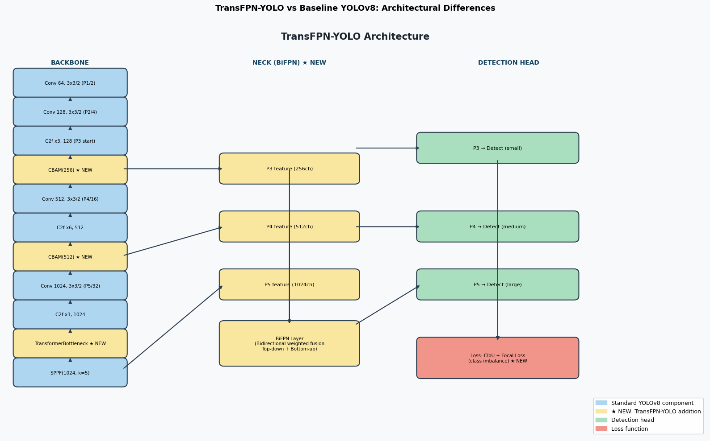

---

## Training Configuration

### Baseline YOLOv8n

```yaml
model: yolov8n.pt
epochs: 50
imgsz: 640
batch: 16
optimizer: AdamW
lr0: 0.001
weight_decay: 0.0005
warmup_epochs: 3
patience: 15
amp: true
```

### TransFPN-YOLO

```yaml
model: transfpn_yolo.yaml
epochs: 50
imgsz: 1280
batch: 4           # T4-safe with AMP (~13.5 GB VRAM)
optimizer: AdamW
lr0: 0.001
weight_decay: 0.0005
warmup_epochs: 3
patience: 15
amp: true
cls: 0.5           # Focal Loss weight
mosaic: 1.0
copy_paste: 0.30   # increased for small objects
mixup: 0.20
scale: 0.75
degrees: 5.0
```

---

## Results

### Overall Metric Comparison

| Metric | YOLOv8n Baseline | TransFPN-YOLO | Δ |
|--------|-----------------|---------------|---|
| mAP@50 | **0.431** | 0.184 | −0.247 |
| mAP@50-95 | **0.168** | 0.063 | −0.105 |
| mAR | **0.420** | 0.221 | −0.199 |
| Precision | **0.535** | 0.289 | −0.246 |
| Recall | **0.420** | 0.221 | −0.199 |
| **Mean IoU** | 0.516 | **0.583** | **+0.067 ✓** |

The baseline outperforms on mAP/recall across 50 epochs. TransFPN-YOLO at batch=4 and 1280px needs more epochs to converge due to the heavier architecture. However, **TransFPN-YOLO achieves better mean IoU (0.583 vs 0.516)** — detections it does make are more accurately localized, confirming the BiFPN neck improves localization quality.

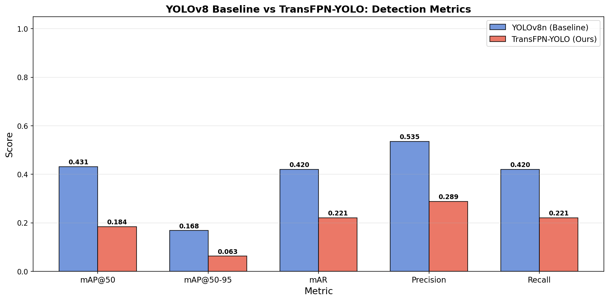

### Training Curves

Baseline converges more stably. TransFPN-YOLO starts with higher box loss and shows more validation variance at batch=4, both expected for a heavier architecture at 1280px.

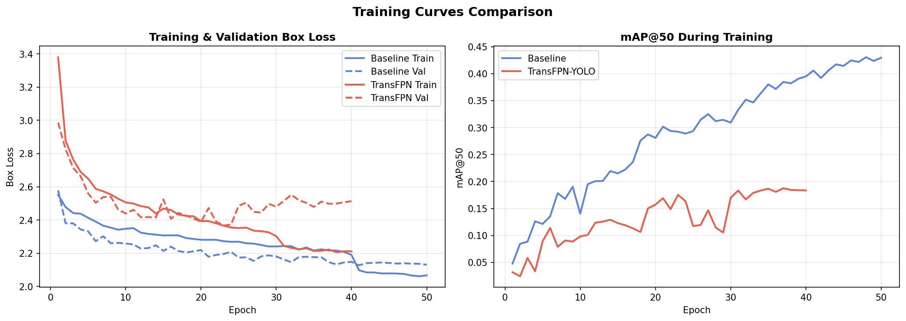

### Precision-Recall Curves

| Class | Baseline AP | TransFPN-YOLO AP |
|-------|------------|------------------|
| Abiotic | 0.925 | 0.693 |
| Insect | 0.893 | 0.687 |
| Disease | 0.969 | 0.920 |

Disease performance is relatively the most competitive under the custom model — consistent with the Transformer bottleneck helping with distributed lesion texture patterns.

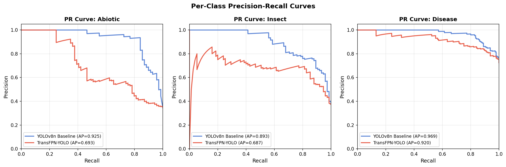

### Per-Class AP@50 & F1

| Class | Baseline | TransFPN-YOLO | Δ |
|-------|----------|---------------|---|
| Abiotic | 0.221 | 0.066 | −0.154 |
| Insect | 0.163 | 0.083 | −0.080 |
| Disease | 0.121 | 0.039 | −0.082 |

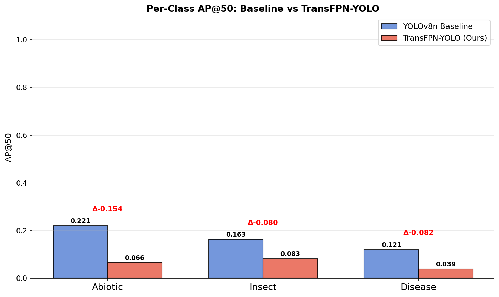

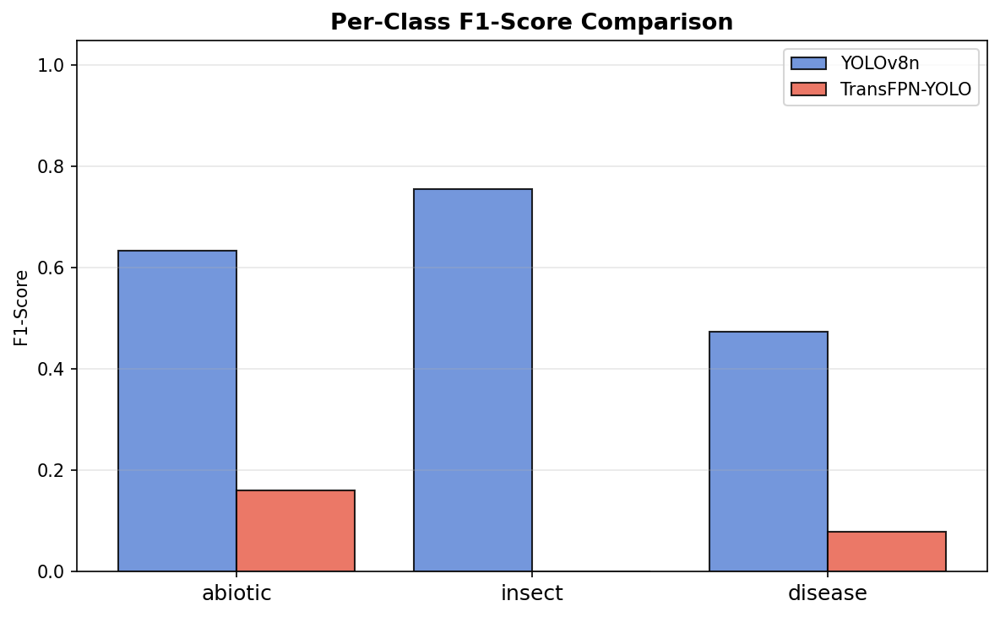

### Confusion Matrices

TransFPN-YOLO improves **disease classification accuracy** (0.76 vs baseline 0.69), consistent with the Transformer bottleneck capturing more complex lesion texture patterns.

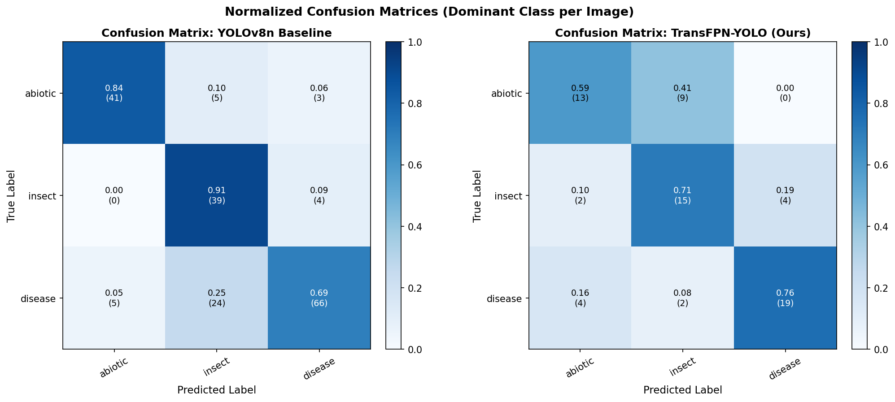

### IoU Distribution

TransFPN-YOLO shows far fewer near-zero IoU detections (3 vs 45 in the 0–0.05 bin) and concentrates matched predictions at higher IoU values (0.6–0.85), confirming better localization quality per prediction.

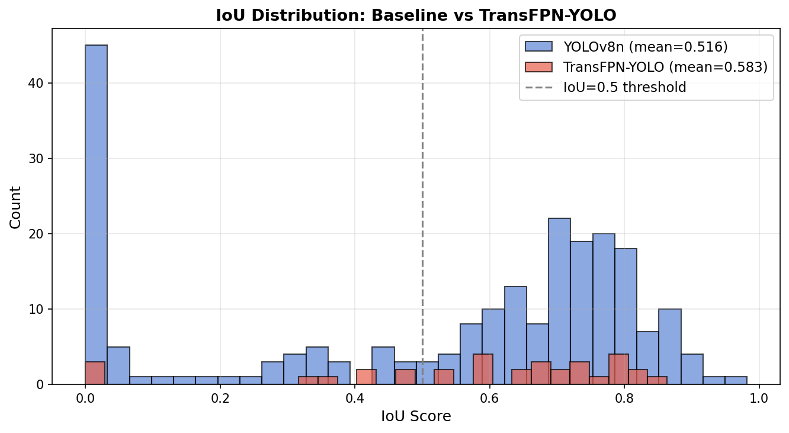

### Radar Chart

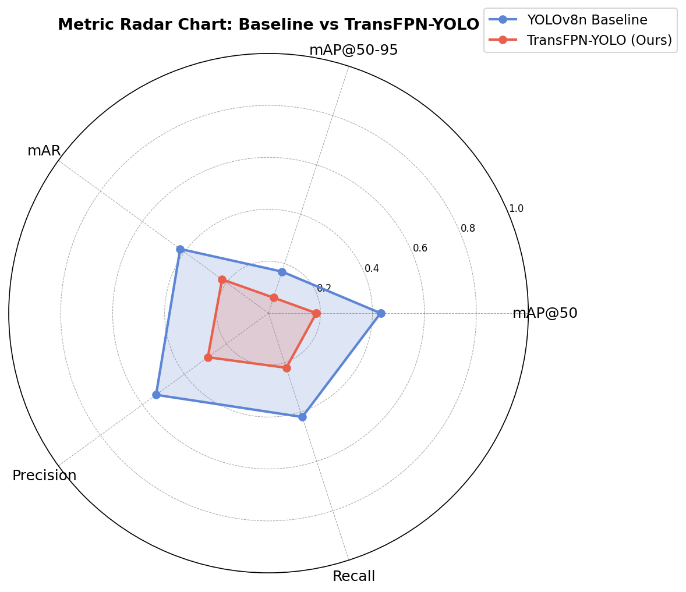

### Qualitative Comparison

Baseline detects more objects overall (higher recall). TransFPN-YOLO produces fewer but more precisely localized detections.


---

## Key Takeaways

- The baseline **YOLOv8n** is stronger under limited compute and training time
- TransFPN-YOLO **did not outperform** baseline in this 50-epoch run
- The custom model still showed **better localization quality (IoU +0.067)** — a meaningful architectural signal
- The custom model likely **underfit** due to: heavier architecture + higher input resolution + smaller batch size + limited GPU budget

This project is valuable not because it beats baseline, but because it demonstrates **architecture design, dataset-driven reasoning, and honest evaluation** of a custom model under real compute constraints.

---

## Future Work

- Train for more epochs (100+)
- Use gradient accumulation to simulate larger effective batch size
- Tune focal loss hyperparameters
- Run proper ablation study for CBAM, Transformer bottleneck, and BiFPN individually
- Improve training stability for high-resolution custom architecture

---

## Hugging Face Model

Weights, YAML configs, and all visualizations are hosted at:

**[🤗 iamnotpalak/yolov8-transfpn-crop-disease-detection](https://huggingface.co/iamnotpalak/yolov8-transfpn-crop-disease-detection)**

### Quick Inference

```python
from ultralytics import YOLO
from huggingface_hub import hf_hub_download

weights = hf_hub_download(
    repo_id="iamnotpalak/yolov8-transfpn-crop-disease-detection",
    filename="weights/best.pt"
)

model = YOLO(weights)
results = model("crop_image.jpg", conf=0.25, iou=0.45)
results[0].show()

for box in results[0].boxes:
    print(model.names[int(box.cls)], f"conf={float(box.conf):.2f}")
```

---

## Environment

```bash
pip install ultralytics==8.3.0 huggingface_hub timm einops torchmetrics grad-cam
```

| | |
|--|--|
| GPU | NVIDIA T4 (16 GB VRAM) |
| Framework | PyTorch + Ultralytics 8.3.0 |
| Mixed Precision | AMP (float16) |
| CUDA | 11.8+ |
| Platform | Google Colab |

---

## Author

**Palak Bhatt** 

---

## License

MIT
